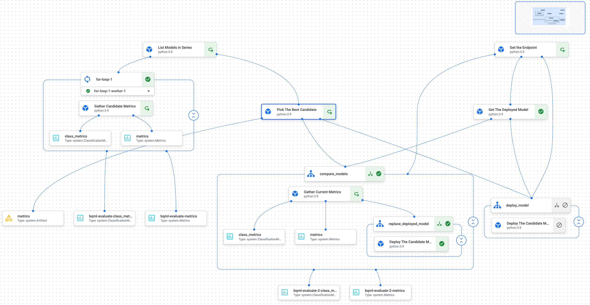

# End to End Vertex AI Pipeline for Fraud Detection
 
## An AI-based Fraud Detection System

  
   

## Overview
The AI-based Fraud Detection System leverages Google Cloud's Vertex AI to deploy the most effective machine learning models for detecting fraudulent transactions in credit card data. This project encapsulates a workflow of training, evaluating, and deploying machine learning models in a cohesive pipeline, ensuring the deployment of the most accurate model available for fraud detection.

## Pipeline: Deploying the Best Performing Model to an Endpoint

## Purpose
This Vertex AI Pipeline orchestrates the selection, deployment, and real-time monitoring of the highest-performing machine learning model from a pool of candidates. Designed to support a dynamic and collaborative model development environment, it ensures that only the most accurate and relevant models are deployed for fraud detection tasks.

## Context
The development and refinement of machine learning models for fraud detection is a continuous process that benefits from diverse approaches and collective expertise. This pipeline facilitates:

- **Collaborative Development:** Allows multiple team members to contribute models using varied techniques.
- **Iterative Improvement:** Supports ongoing enhancement of models based on performance evaluations.
- **Unified Management:** Models are systematically managed with a shared `series` label in the Vertex AI Model Registry, simplifying identification and comparison.

## Workflow
The pipeline is structured into key phases to streamline the model lifecycle management:

### 1. Candidate Selection
- **Registry Query:** Fetch models tagged with the `series` label and the `default` version alias from the Vertex AI Model Registry.
- **Performance Evaluation:** Execute parallel assessments of candidates focusing on key metrics like accuracy, ROC curves, and confusion matrices.
- **Model Selection:** Identify the model that exhibits superior performance across the evaluation criteria.

### 2. Deployment and Monitoring
- **Endpoint Management:** Evaluate the existing deployment state; if no model is actively deployed, initialize a new endpoint.
- **Model Comparison:** For an active deployment, compare the newly selected model against the current one in terms of traffic and performance metrics.
- **Model Update:** Should the new model outperform the existing deployment, proceed to update the endpoint with the selected model, ensuring optimal performance.

## Benefits
Implementing this pipeline via Vertex AI offers significant advantages:

- **Seamless Automation:** Reduces manual intervention in the model selection and deployment processes.
- **Operational Efficiency:** Leverages serverless architecture to minimize resource overhead and expedite executions.
- **Enhanced Collaboration:** Centralizes model contributions and evaluations, fostering a productive team environment.
- **Continuous Monitoring:** Incorporates ongoing performance tracking to maintain and enhance model accuracy.

#### Pipeline Implementation
This approach has been materialized into a Vertex AI Pipeline, enabling a serverless execution of the entire workflow. Each step of the outlined workflow is encapsulated into components that interact through defined inputs and outputs.

### Pipelines
Pipelines represent workflows with multiple interdependent steps. Utilizing Vertex AI Pipelines, we can automate the model training, evaluation, and deployment process efficiently, treating each workflow step as a component within the pipeline.

### Prerequisites
- **BQML Models:** One or more BigQuery ML models that have been registered in the Vertex AI Model Registry.

## Contact

Zachary Nguyen - [@LinkedIn](https://www.linkedin.com/in/zacharyvunguyen/) - zacharynguyen.ds@gmail.com

Project Link: [https://github.com/zacharyvunguyen/End-to-End-Vertex-AI-Pipeline-for-Fraud-Detection](https://github.com/zacharyvunguyen/End-to-End-Vertex-AI-Pipeline-for-Fraud-Detection)

## Acknowledgements

- [Streamlit](https://streamlit.io/)
- [Google Cloud Platform](https://cloud.google.com/)
